# ReviewX Platform - Entity Relationship Diagram (ERD)

## 개요
ReviewX 플랫폼의 데이터베이스 구조를 시각적으로 표현한 ERD입니다. 
총 9개의 주요 엔티티로 구성되어 있으며, 사용자 관리, 권한 제어, 캠페인 운영, 리뷰 관리, 포인트 거래, 파일 관리, 출금 처리 기능을 지원합니다.

## ERD 다이어그램

```mermaid
erDiagram
    %% 사용자 관리
    User {
        bigint user_id PK
        varchar email UK
        varchar password
        varchar name
        varchar nickname UK
        varchar phone
        datetime birth_date
        enum gender
        varchar address
        varchar detail_address
        varchar zip_code
        enum provider
        varchar provider_id
        varchar profile_image_url
        enum status
        varchar bank_name
        varchar account_number
        varchar account_holder
        int point_balance
        int pending_withdrawal
        int total_campaigns
        int completed_campaigns
        int rejected_count
        int approved_reviews
        int total_earned_points
        varchar business_name
        varchar business_number
        varchar business_type
        varchar blog_url
        varchar instagram_url
        varchar youtube_url
        int follower_count
        datetime created_at
        datetime updated_at
        datetime last_login_at
        datetime deleted_at
        bigint role_id FK
    }

    Role {
        bigint role_id PK
        varchar role_code UK
        varchar role_name
        text description
        boolean is_active
        datetime created_at
        datetime updated_at
    }

    Permission {
        bigint permission_id PK
        varchar permission_code UK
        varchar permission_name
        varchar resource
        varchar action
        text description
        boolean is_active
        datetime created_at
        datetime updated_at
    }

    RolePermission {
        bigint role_id PK,FK
        bigint permission_id PK,FK
        datetime created_at
    }

    %% 캠페인 관리
    Campaign {
        bigint campaign_id PK
        bigint partner_id FK
        varchar title
        text description
        enum campaign_type
        enum review_platform
        varchar product_name
        int product_price
        varchar product_url
        varchar shop_name
        varchar shop_url
        int recruit_count
        int applied_count
        int selected_count
        int reward_point
        text review_guide
        varchar keyword_requirements
        enum review_format
        int min_text_length
        int min_photo_count
        datetime application_start_date
        datetime application_end_date
        datetime selection_date
        datetime review_start_date
        datetime review_end_date
        boolean shipping_required
        int shipping_fee
        varchar shipping_note
        varchar visit_address
        varchar visit_detail_address
        varchar visit_note
        varchar content_format
        text posting_requirements
        enum status
        int total_budget
        int platform_fee
        int final_cost
        bigint reviewer_admin_id FK
        varchar admin_note
        datetime reviewed_at
        int completed_reviews
        int approved_reviews
        int rejected_reviews
        datetime created_at
        datetime updated_at
        datetime deleted_at
    }

    %% 리뷰 관리
    Review {
        bigint review_id PK
        bigint campaign_id FK
        bigint reviewer_id FK
        bigint partner_id FK
        varchar title
        text content
        int rating
        varchar platform_url
        varchar platform_review_id
        datetime posted_at
        varchar keywords_used
        varchar hashtags
        boolean purchase_confirmed
        varchar order_number
        int purchase_amount
        varchar delivery_address
        datetime delivered_at
        boolean visit_confirmed
        datetime visited_at
        int visit_duration
        int companion_count
        int view_count
        int like_count
        int comment_count
        int share_count
        enum status
        bigint reviewed_by_partner_id FK
        bigint reviewed_by_admin_id FK
        varchar partner_feedback
        varchar admin_feedback
        varchar rejection_reason
        datetime partner_reviewed_at
        datetime admin_reviewed_at
        int reward_point
        boolean point_paid
        datetime point_paid_at
        double quality_score
        int text_length
        int photo_count
        int video_count
        varchar device_info
        varchar ip_address
        varchar user_agent
        datetime created_at
        datetime updated_at
        datetime submitted_at
        datetime deleted_at
    }

    %% 포인트 관리
    PointTransaction {
        bigint transaction_id PK
        bigint user_id FK
        enum transaction_type
        int amount
        int balance_before
        int balance_after
        bigint related_campaign_id FK
        bigint related_review_id FK
        varchar description
        varchar reference_id
        enum payment_method
        varchar payment_key
        varchar order_id
        bigint processed_by_admin_id FK
        varchar admin_note
        enum status
        datetime created_at
        datetime updated_at
        datetime processed_at
        datetime cancelled_at
    }

    %% 출금 관리
    Withdrawal {
        bigint withdrawal_id PK
        bigint user_id FK
        varchar withdrawal_number UK
        int requested_amount
        int withdrawal_amount
        int fee_amount
        decimal fee_rate
        int minimum_fee
        int maximum_fee
        varchar bank_name
        varchar account_number
        varchar account_holder
        enum status
        bigint processed_by_admin_id FK
        varchar admin_note
        varchar rejection_reason
        varchar bank_transaction_id
        varchar bank_reference_number
        varchar bank_response_code
        varchar bank_response_message
        bigint point_transaction_id FK
        datetime requested_at
        datetime processed_at
        datetime completed_at
        datetime cancelled_at
        boolean auto_process_eligible
        datetime scheduled_process_date
        boolean verification_required
        enum verification_type
        boolean verification_completed
        datetime created_at
        datetime updated_at
    }

    %% 파일 관리
    AttachedFile {
        bigint file_id PK
        bigint review_id FK
        bigint campaign_id FK
        bigint user_id FK
        varchar original_filename
        varchar stored_filename
        varchar file_path
        varchar file_url
        bigint file_size
        varchar content_type
        varchar file_extension
        enum file_type
        enum attachment_type
        int image_width
        int image_height
        varchar thumbnail_url
        int display_order
        boolean is_primary
        enum status
        bigint uploaded_by_id FK
        varchar upload_ip
        varchar user_agent
        enum storage_provider
        varchar bucket_name
        varchar object_key
        varchar file_hash
        enum virus_scan_result
        datetime scan_date
        datetime created_at
        datetime updated_at
        datetime deleted_at
    }

    %% 관계 정의
    User }|--|| Role : "has role"
    Role ||--o{ RolePermission : "has permissions"
    Permission ||--o{ RolePermission : "granted to roles"
    
    User ||--o{ Campaign : "partner creates"
    Campaign }|--|| User : "created by partner"
    Campaign }|--o| User : "reviewed by admin"
    
    Campaign ||--o{ Review : "has reviews"
    Review }|--|| Campaign : "belongs to"
    Review }|--|| User : "written by reviewer"
    Review }|--|| User : "for partner"
    Review }|--o| User : "reviewed by partner"
    Review }|--o| User : "reviewed by admin"
    
    User ||--o{ PointTransaction : "has transactions"
    PointTransaction }|--o| Campaign : "related to"
    PointTransaction }|--o| Review : "related to"
    PointTransaction }|--o| User : "processed by admin"
    
    User ||--o{ Withdrawal : "requests withdrawals"
    Withdrawal }|--o| User : "processed by admin"
    Withdrawal }|--o| PointTransaction : "linked to transaction"
    
    Review ||--o{ AttachedFile : "has attachments"
    Campaign ||--o{ AttachedFile : "has attachments"
    User ||--o{ AttachedFile : "has profile images"
    AttachedFile }|--|| User : "uploaded by"
```



## 엔티티 상세 설명

### 1. 사용자 관리 (User Management)

#### User 엔티티
- **목적**: 플랫폼의 모든 사용자 정보 관리 (파트너, 리뷰어, 관리자)
- **주요 필드**:
  - 기본 정보: email, name, nickname, phone, birth_date, gender, address
  - 소셜 로그인: provider, provider_id, profile_image_url
  - 사용자 상태: status (ACTIVE, INACTIVE, SUSPENDED, BLACKLISTED, PENDING)
  - 정산 정보: bank_name, account_number, account_holder
  - 포인트 관리: point_balance, pending_withdrawal
  - 활동 통계: total_campaigns, completed_campaigns, approved_reviews
  - 비즈니스 정보: business_name, business_number, business_type
  - 채널 정보: blog_url, instagram_url, youtube_url, follower_count

#### Role 엔티티
- **목적**: 사용자 역할 정의 및 관리
- **역할 타입**:
  - REVIEWER: 캠페인 참여 및 리뷰 작성
  - PARTNER: 캠페인 등록 및 관리
  - ADMIN: 캠페인 운영 관리, 참여자 검수, 정산 승인
  - SUPER_ADMIN: 시스템 전체 관리 및 정책 수립

#### Permission 엔티티
- **목적**: 시스템 권한 세분화 관리
- **권한 구조**: resource + action 조합 (예: campaign_create, review_approve, user_manage)

#### RolePermission 엔티티
- **목적**: 역할과 권한의 N:M 관계 매핑
- **복합키**: role_id + permission_id

### 2. 캠페인 관리 (Campaign Management)

#### Campaign 엔티티
- **목적**: 리뷰 캠페인의 모든 정보 관리
- **캠페인 유형**:
  - DELIVERY: 배송형 (네이버쇼핑 구매 → 배송 → 리뷰)
  - PURCHASE_REVIEW: 구매평 (배송형 + 리뷰 형식 선택)
  - EXPERIENCE: 체험단 (매장 방문 → 네이버플레이스 리뷰)
  - VISIT: 방문형 (플랫폼 자료로 방문 리뷰)
  - JOURNALIST: 기자단 (가이드 원고 기반 SNS/블로그)
- **상태 관리**: DRAFT → PENDING_REVIEW → APPROVED → RECRUITING → IN_PROGRESS → COMPLETED
- **주요 기능**: 모집 관리, 일정 관리, 예산 관리, 성과 추적

### 3. 리뷰 관리 (Review Management)

#### Review 엔티티
- **목적**: 리뷰어가 작성한 모든 리뷰 정보 관리
- **검토 프로세스**: 
  1. 리뷰어 작성 (DRAFT → SUBMITTED)
  2. 파트너 1차 검토 (PARTNER_APPROVED/PARTNER_REJECTED)
  3. 관리자 2차 검토 (ADMIN_REVIEW → APPROVED/REJECTED)
- **품질 관리**: quality_score 자동 계산, 성과 지표 추적
- **증빙 관리**: 구매 확인, 배송 확인, 방문 확인 기능

### 4. 포인트 관리 (Point Management)

#### PointTransaction 엔티티
- **목적**: 모든 포인트 거래 내역 추적
- **거래 타입**:
  - 파트너: CHARGE(충전), CAMPAIGN_PAYMENT(캠페인 결제), CAMPAIGN_REFUND(환불)
  - 리뷰어: REVIEW_REWARD(리뷰 보상), WITHDRAWAL(출금), WITHDRAWAL_CANCEL(출금 취소)
  - 공통: ADMIN_ADJUSTMENT(관리자 조정), BONUS(보너스), PENALTY(패널티)
- **잔액 추적**: balance_before, balance_after로 거래 전후 잔액 관리

### 5. 출금 관리 (Withdrawal Management)

#### Withdrawal 엔티티
- **목적**: 리뷰어의 포인트 출금 신청 및 처리 관리
- **수수료 정책**: 금액별 차등 수수료율 적용
- **자동 처리**: 조건 충족 시 자동 처리 가능 (금액, 신뢰도 기반)
- **검증 시스템**: 필요시 추가 검증 절차 적용
- **상태 관리**: PENDING → UNDER_REVIEW → APPROVED → PROCESSING → COMPLETED

### 6. 파일 관리 (File Management)

#### AttachedFile 엔티티
- **목적**: 다양한 엔티티의 첨부파일 통합 관리
- **파일 타입**: IMAGE, VIDEO, DOCUMENT, AUDIO, ARCHIVE, OTHER
- **첨부 타입**:
  - 리뷰 관련: REVIEW_IMAGE, REVIEW_VIDEO, PURCHASE_PROOF, DELIVERY_PROOF, VISIT_PROOF
  - 캠페인 관련: CAMPAIGN_IMAGE, PRODUCT_IMAGE, GUIDE_DOCUMENT
  - 사용자 관련: PROFILE_IMAGE, ID_VERIFICATION, BUSINESS_LICENSE
- **클라우드 지원**: AWS S3, GCP Cloud Storage, Naver Cloud 등
- **보안 기능**: 바이러스 스캔, 파일 해시 검증

## 주요 비즈니스 플로우별 엔티티 연관관계

### 1. 캠페인 생성 및 승인 플로우
```
User (Partner) → Campaign → User (Admin) → Campaign (Status Update)
```
1. 파트너가 캠페인 생성 (Campaign.partner_id → User.user_id)
2. 관리자가 검토 후 승인/반려 (Campaign.reviewer_admin_id → User.user_id)
3. 승인된 캠페인 모집 시작

### 2. 리뷰 작성 및 검토 플로우
```
User (Reviewer) → Review → User (Partner) → User (Admin) → PointTransaction
```
1. 리뷰어가 리뷰 작성 (Review.reviewer_id → User.user_id)
2. 파트너 1차 검토 (Review.reviewed_by_partner_id → User.user_id)
3. 필요시 관리자 2차 검토 (Review.reviewed_by_admin_id → User.user_id)
4. 승인 시 포인트 지급 (PointTransaction.user_id → User.user_id)

### 3. 포인트 충전 및 캠페인 결제 플로우
```
User (Partner) → PointTransaction (CHARGE) → Campaign → PointTransaction (CAMPAIGN_PAYMENT)
```
1. 파트너가 포인트 충전
2. 캠페인 등록 시 포인트 차감
3. 모든 거래 내역 PointTransaction에 기록

### 4. 출금 신청 및 처리 플로우
```
User (Reviewer) → Withdrawal → User (Admin) → PointTransaction (WITHDRAWAL)
```
1. 리뷰어가 출금 신청
2. 관리자 검토 후 승인/반려
3. 승인 시 포인트 차감 및 실제 송금 처리

### 5. 파일 첨부 및 관리 플로우
```
User → AttachedFile → Review/Campaign/User (Profile)
```
1. 사용자가 파일 업로드
2. 해당 엔티티에 첨부 (review_id, campaign_id, user_id 중 하나)
3. 파일 타입 및 첨부 타입에 따른 분류 관리

## 인덱스 및 성능 최적화 고려사항

### 주요 인덱스
- User: email(UK), nickname(UK), role_id, status, created_at
- Campaign: partner_id, status, application_end_date, created_at
- Review: campaign_id, reviewer_id, partner_id, status, created_at
- PointTransaction: user_id, transaction_type, status, created_at
- Withdrawal: user_id, status, requested_at
- AttachedFile: review_id, campaign_id, user_id, file_type, status

### 쿼리 최적화 전략
1. **페이지네이션**: created_at 기준 정렬 및 LIMIT 사용
2. **상태별 조회**: status 컬럼 인덱스 활용
3. **연관 조회**: fetch type LAZY 사용으로 N+1 문제 방지
4. **통계 쿼리**: 집계 함수 사용 시 적절한 인덱스 설계

## 확장 가능성

### 향후 추가 고려사항
1. **알림 시스템**: Notification 엔티티 추가
2. **쿠폰 시스템**: Coupon, CouponUsage 엔티티 추가
3. **리뷰 댓글**: ReviewComment 엔티티 추가
4. **캠페인 즐겨찾기**: CampaignBookmark 엔티티 추가
5. **사용자 팔로우**: UserFollow 엔티티 추가
6. **리뷰 신고**: ReviewReport 엔티티 추가

이 ERD는 ReviewX 플랫폼의 핵심 기능을 지원하며, 확장 가능한 구조로 설계되었습니다.